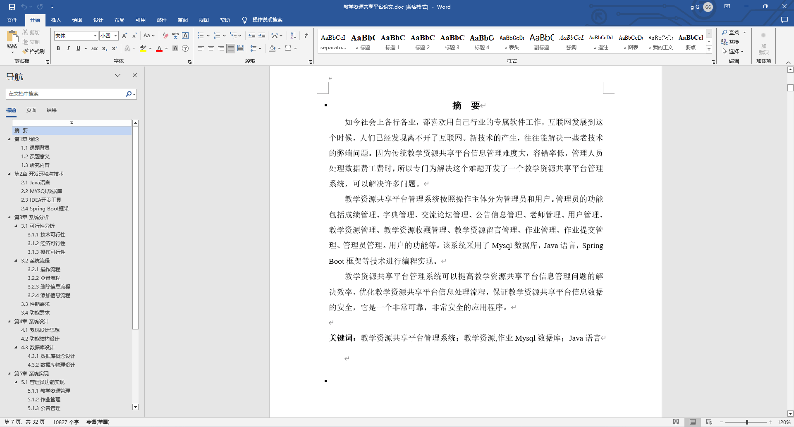
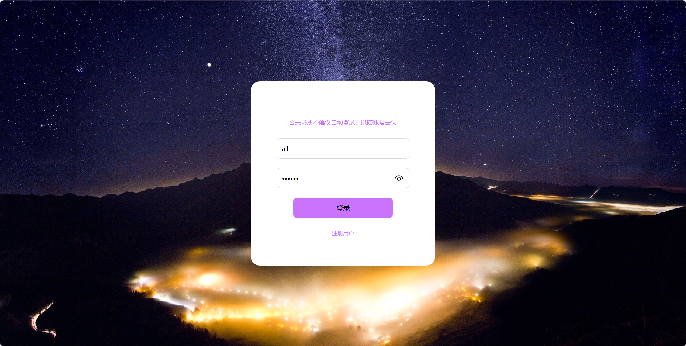
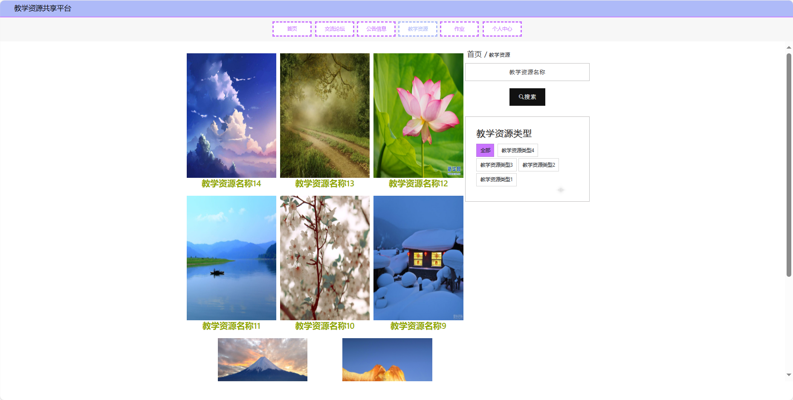
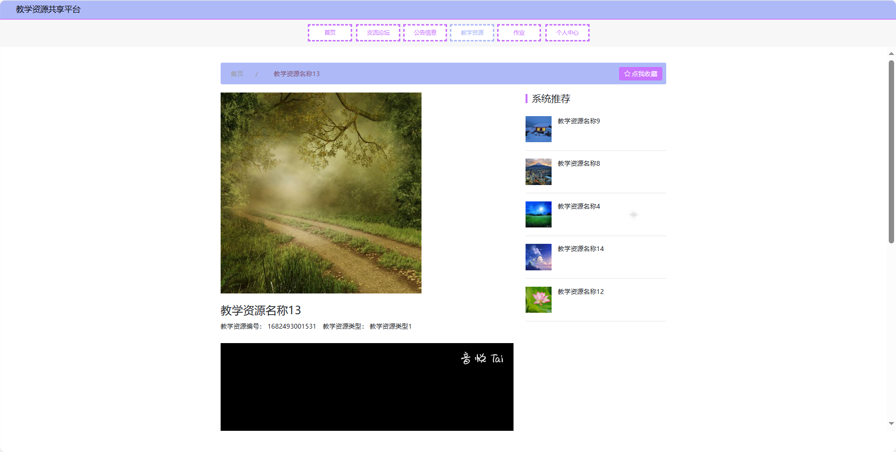
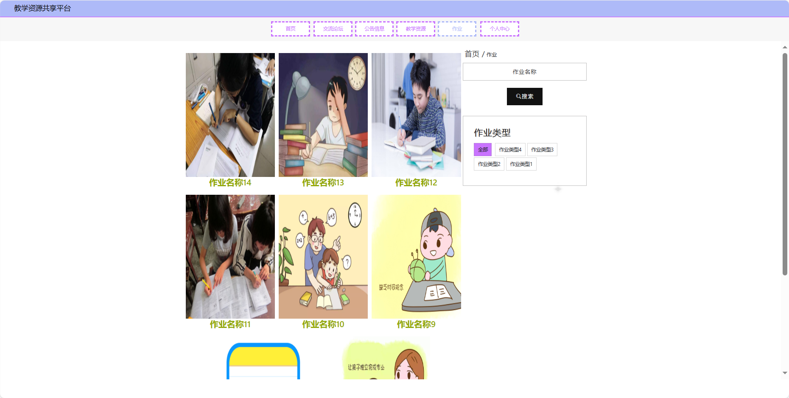
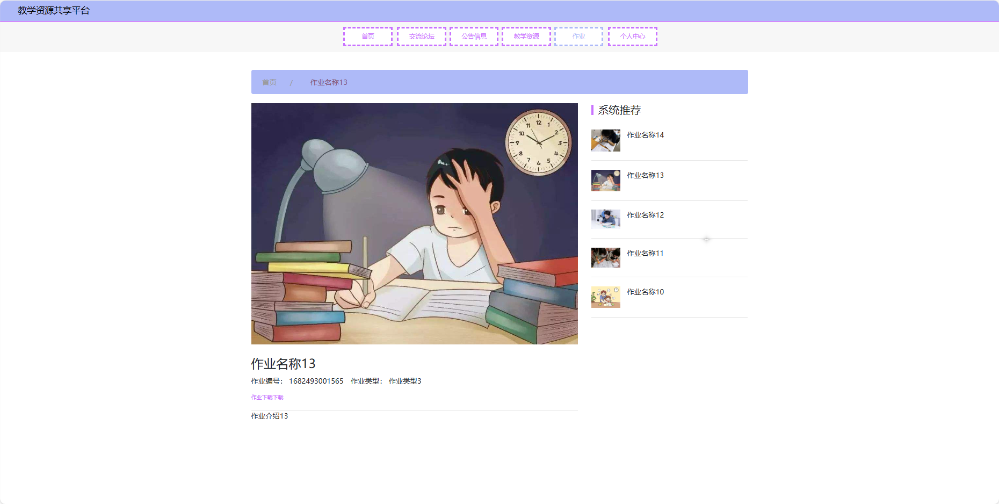
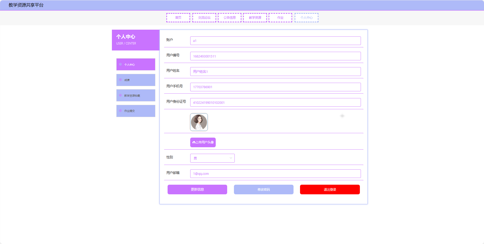
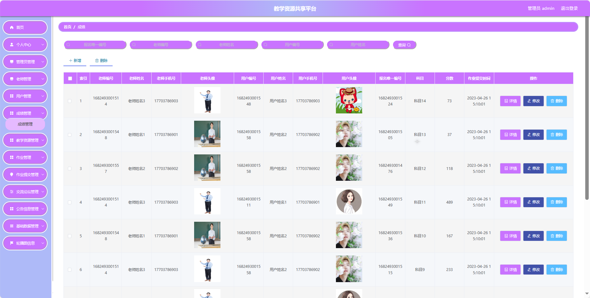
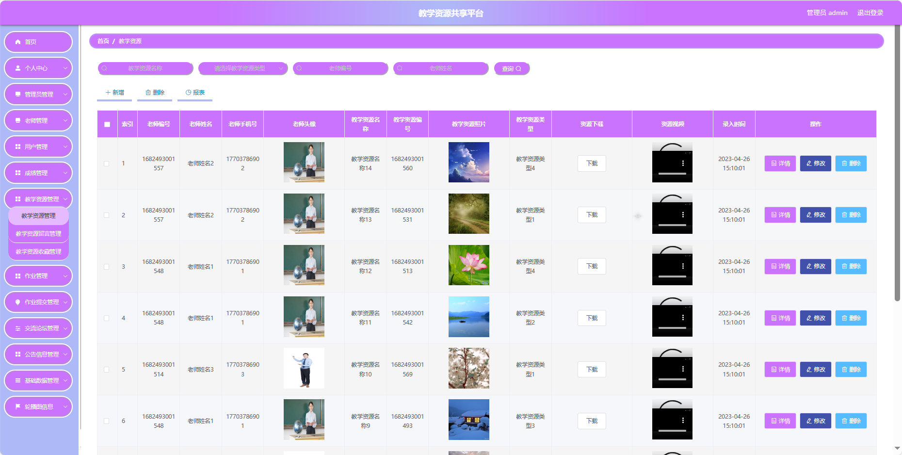

## 基于SpringBoot的教学资源共享平台(程序+报告)

###  获取sql数据库文件: 从戎源码网 (https://armycodes.com/) QQ: 386869957 QQ群: 377586148
###  所有系统地址: (https://github.com/YuLin-Coder/AllProjectCatalog) 
###  所有项目以及源代码本人均调试运行无问题 可支持远程安装部署调试、定制修改、代码讲解

## 项目介绍
基于SpringBoot的教学资源共享平台，系统包含三种角色：管理员、用户,教师主要功能如下。

【用户功能】
1. **首页：** 用户登录后的系统主页。
2. **交流论坛：** 学生和教师可以在这里进行互动和交流。
3. **公告信息：** 查看学校或教师发布的通知和公告。
4. **教学资源：** 浏览、搜索并下载教师上传的教学资源等。
5. **作业：** 查看布置的作业任务、截止日期等，并提交作业。
6. **个人中心：** 用户个人信息的管理中心等。

【管理员功能】
1. **首页：** 显示系统的整体概况。
2. **个人中心：**
   - **修改密码：** 修改管理员账户的登录密码。
   - **个人信息：** 查看和编辑管理员的基本信息。
3. **管理员管理：** 管理系统中的管理员账户。
4. **老师管理：** 对教师账户进行管理。
5. **用户管理：** 对学生账户进行管理
6. **成绩管理：** 查看学生的成绩情况。
7. **教学资源管理：** 管理教学资源。
   - **教学资源留言管理：** 查看和管理教学资源的留言评论。
   - **教学资源收藏管理：** 管理用户对教学资源的收藏。
8. **作业管理：** 管理作业的发布，包括作业的添加、编辑和删除。
   - **作业提交管理：** 查看学生提交的作业情况，评分等。
9. **交流论坛管理：** 管理学生和教师的交流平台。
10. **公告信息管理：** 管理通知公告。
11. **基础数据管理：**
    - **帖子类型管理：** 维护交流论坛帖子的分类。
    - **公告类型管理：** 维护通知公告的分类。
    - **教学资源类型管理：** 管理教学资源的分类。
    - **作业类型管理：** 管理作业的分类。
12. **轮播图信息：** 管理系统首页的轮播图信息。

【教师功能】
1. **首页：** 显示个人教学信息和提醒。
2. **个人中心：**
   - **修改密码：** 修改个人账户的登录密码。
   - **个人信息：** 查看和编辑个人基本信息。
3. **用户管理：** 查看自己所教班级的学生信息。
4. **成绩管理：** 查看自己教授课程的学生成绩情况。
5. **教学资源管理：** 管理自己的教学资源。
   - **教学资源留言管理：** 查看和管理教学资源的留言评论。
6. **作业管理：** 布置作业、查看作业详情、评分等。
   - **作业提交管理：** 查看学生提交的作业情况。
7. **交流论坛管理：** 管理学生和教师的交流平台。
8. **公告信息管理：** 发布和管理通知公告，。
9. **轮播图信息：** 管理系统首页的轮播图信息。

## 项目技术
- 编程语言：Java
- 数据库：MySQL
- 项目管理工具：Maven
- 前端技术：HTML、CSS、JavaScript、Jquery、Vue
- 后端技术：Spring、SpringMVC、MyBatis

## 运行环境
- JDK版本：JDK1.8及以上
- 开发工具：IDEA、Ecplise、Myecplise都可以
- 数据库: MySQL5.7及以上
- Maven：maven3.0及以上
- Node：14.14.0及以上

## 运行截图

